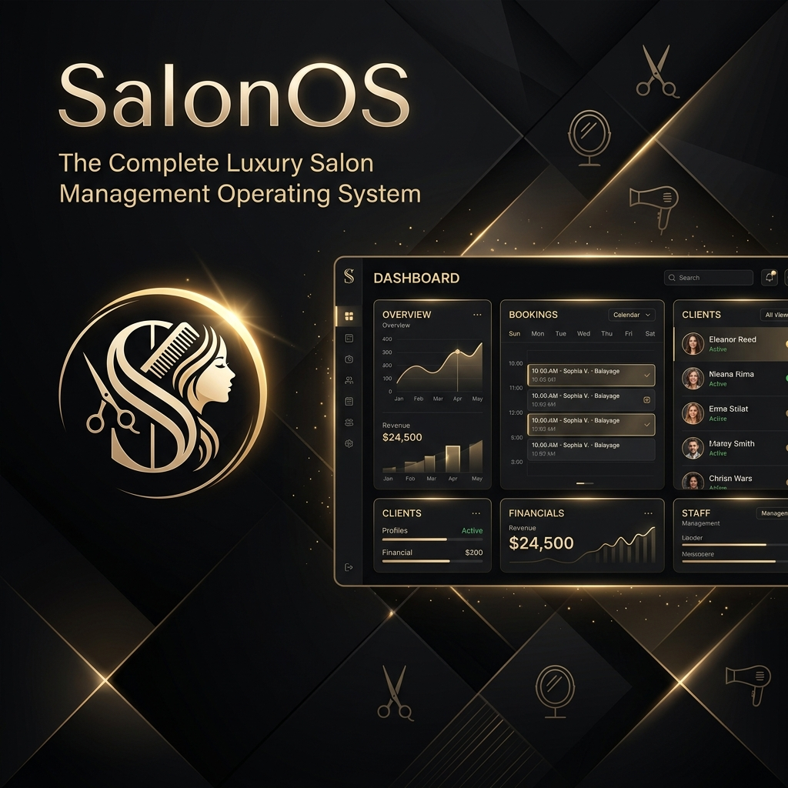

# SalonOS — Enterprise Salon Operating System

SalonOS is an enterprise-grade, multi-tenant Salon Operating System designed to compete with luxury salon software like Fresha, Vagaro, and Boulevard. It expands a simple chatbot qualification panel into a full-scale backend and front-office suite. The application maintains an Obsidian-Black (`#070709`) and Champagne-Gold (`#D6B885`) aesthetic.

---

## 🛠️ Technology Stack

* **Backend Core**: Python 3.13 + FastAPI REST API
* **Database & ORM**: SQLite (development) and PostgreSQL-ready schemas via SQLAlchemy
* **Authentication**: JWT token verification with Role-Based Access Control (RBAC)
* **Frontend UI**: Responsive HTML5, Vanilla CSS3, custom WebGL canvas mesh, and Vanilla JS
* **Charting**: Chart.js for real-time analytics
* **Communication**: WebSocket support for operator-takeover chat routing

---

## 📂 Project Structure Blueprint

```text
SalonOS/
├── backend/
│   ├── app/
│   │   ├── database.py       # Database models and session configs
│   │   ├── main.py           # Core FastAPI application & routes
│   │   ├── auth_router.py     # JWT & RBAC management
│   │   ├── booking_router.py  # Slot allocations & autopilot scheduler
│   │   ├── finance_router.py  # POS checkout, GST calculations, gift cards
│   │   ├── staff_router.py    # Shift scheduling & commission models
│   │   ├── inventory_router.py# Inventory tracking & alert thresholds
│   │   └── inbox_router.py    # WebSocket communication routing
│   └── test_integration.py   # Automated integration test suite
└── frontend/
    ├── widget.html           # Premium client-facing booking portal
    └── dashboard.html        # Owner console and analytics workspace
```

---

## 🗄️ Database Schema & Tenant Isolation (`database.py`)

Data is isolated per tenant using a `tenant_id` foreign key. The models include:

1. **Tenant**: Manages salon subdomains, subscription levels, and custom brand configurations.
2. **User**: Handles credentials, contact details, and RBAC roles (owner, manager, receptionist, stylist, customer).
3. **Appointment**: Tracks bookings, statuses (pending, confirmed, cancelled), and the AI Autopilot toggle.
4. **Product**: Catalog tracking SKUs, pricing, stock levels, and alert thresholds.
5. **Shift**: Clock-in/out timestamps and accumulated commission payouts for stylists.
6. **Invoice**: Financial records computing subtotal, 18% GST tax, discounts, and final totals.
7. **Message**: Chat transcripts from the AI receptionist or manual operator takeover.
8. **StylistProfile**: Contains experience levels, bio details, ratings, and availability matrices.
9. **ActivityLog**: Event logs for the live activity feed (bookings, payments, reviews).
10. **Membership**: Manages customer loyalty card tiers (silver, gold, platinum).
11. **GiftCard**: Code-based credit cards (e.g., `GIFT-AURA-100` with a $100 balance) for checkout POS checkouts.
12. **ClientMemory**: Keeps client-specific notes like allergies, budget preferences, and preferred staff.
13. **Notification**: Administrative warnings for low-stock inventory or reservation alerts.

---

## ⚙️ Modular Backend API Endpoints (`backend/app/`)

* `auth_router.py`: Handles authentication, password hashing, and token issue.
* `booking_router.py`: Manages direct scheduling, slot verification, status changes, and autopilot flags.
* `finance_router.py`: Processes cart checkouts, computes 18% GST tax, checks and issues gift cards.
* `staff_router.py`: Handles shifts, commissions, and staff leaderboard computations.
* `inventory_router.py`: Adds and deletes inventory, checking for stock depletion.
* `inbox_router.py`: Directs WebSockets for real-time operator-client messages takeover.
* `main.py`: Defines main AI engine routing, CRM 360 details queries, dashboard activity feeds, and today's business snapshots.

---

## 🎨 Frontend & Visual Overhauls

### 💎 Customer-Facing Booking Widget (`frontend/widget.html`)
* **Interactive Fluid Canvas**: Liquid mesh WebGL background providing a premium feel.
* **Before/After Image Comparison Slider**: Drag-to-reveal canvas showcasing beauty transformations.
* **7-Step Reservation Wizard**:
  * **Step 1**: Choose Service (Hair, Skin, Nails, Body).
  * **Step 2**: Choose Stylist (Lists specialties, ratings, and bios).
  * **Step 3**: Choose Date (Dynamic calendar picker).
  * **Step 4**: Choose Time (Flags recommended slots).
  * **Step 5**: Review Booking Details.
  * **Step 6**: Payment POS Checkout (Applies gift cards).
  * **Step 7**: Receipt page with print button.

### 📊 Administrator Operator Dashboard (`frontend/dashboard.html`)
* **Today's Business Snapshot**: Real-time KPI counters (Revenue, Conversion Rate, Ticket Size, Lead count).
* **Live Activities Panel**: Polled drawer (every 5 seconds) feeding events like bookings, reschedules, and payments.
* **Inbox Customer 360**: Displays client spend, loyalty points, allergies, and an automated AI summary of client preferences.
* **Channels Simulator**: Renders Instagram, WhatsApp, and AI Voice Phone Call interfaces with live transcript logging.

---

## 🧪 Automated Testing Suite (`backend/test_integration.py`)

A suite of 14 integration tests covering core business paths:
* JWT authentication and role-based permissions.
* Client memory & profile generation.
* Today's KPI calculations.
* Activity logs ordering.
* Gift card validation & POS checkout discounts.
* Stock decrements on product purchases.
* Shift clock-in/out logs and stylist commissions.
